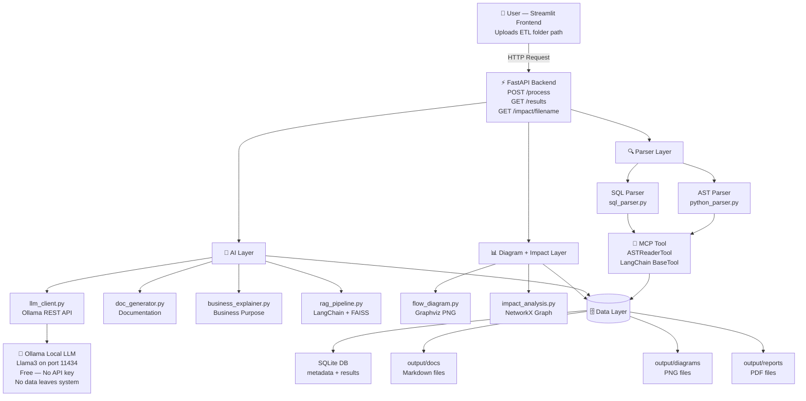
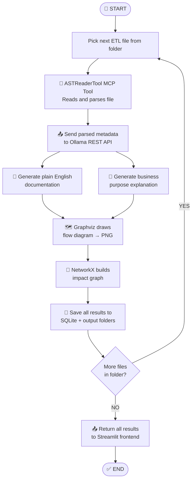

# System Architecture — LENS ETL Script Documentation Generator

## Overview
LENS is a multi-layer AI-powered application that automatically reads 
ETL scripts and generates documentation, business explanations, flow 
diagrams, and impact analysis reports.

---

## System Architecture

---

## Agent Loop Flow

---

## Mandatory AI Capabilities Satisfied

| Capability | How Satisfied |
|---|---|
| ✅ Agent Loop | LangChain agent automatically loops through every ETL file in the folder |
| ✅ MCP Tool Built | ASTReaderTool — custom LangChain BaseTool wrapping both parsers |
| ✅ External API Integration | Ollama REST API called via requests at http://127.0.0.1:11434 |
